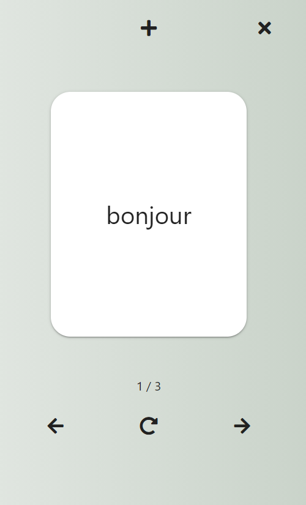

# React Flashcards App

> React-based flashcards app with create, review, and delte actions built with React's context API and the browser's localStorage object

## Overview

App uses context, reducer, and React hooks to manage data at the component level and with the browser's localStorage object.

In the <code>src/context</code> directory, the app reducer is defined to handle changes to the app state, based on the dispatch type from the <code>AppContext</code> file. The <code>AppContext</code> file is also where the app's initial state values are declared, and where the <code>AppProvider</code> component is defined. The <code>AppProvider</code> component wraps around the <code>App</code> component to provide data (and access to the reducer) at a global level.

In the app itself, React hooks are used to read and write data from localStorage. The user can create flashcards, delete flashcards, or review them. In the review view of the cards, a user can toggle from front-to-back and cycle through the cards in order, using the navigation arrows.

## Concepts

* React
  * create-react-app CLI
  * The Context API
  * React Hooks
    * <code>useState</code>
    * <code>useContect</code>
    * <code>useEffect</code>
  * react-router-dom
  * functional components
  * app state
  * <code>onClick()</code>
  * <code>onChange()</code>
  * JSX

* JavaScript
  * ES6 arrow functions
  * ES6 destructuring assignment syntax
  * ES6 let, const variables

### Author

[Brian Beal](https://github.com/brianwbeal)

> [linkedin](https://www.linkedin.com/in/brianwbeal/)

### Version

1.0.0

## Demo

#### [demo](https://elastic-volhard-552161.netlify.app/)